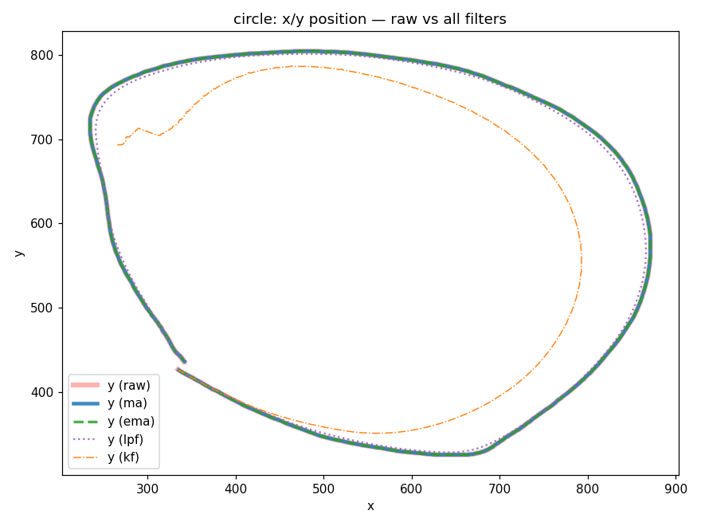
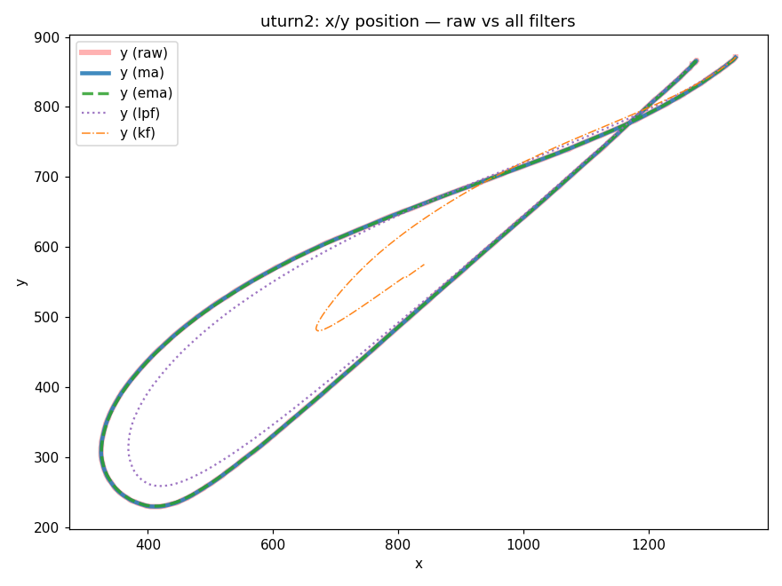
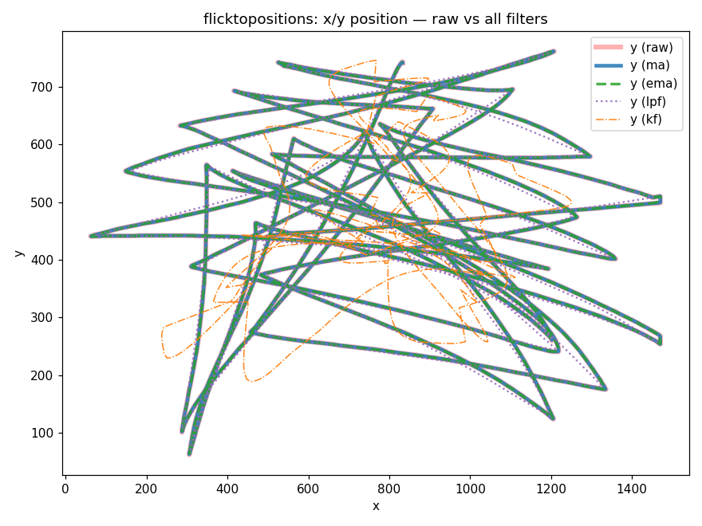

# Filter Comparison — x/y Position

Each plot overlays the **raw** mouse trajectory against all four filters
(`ma`, `ema`, `lpf`, `kf`) at their default parameters, using the `all`
comparison view in `grapher.py`. Colors/styles match the grapher:

| Layer | Color | Style | Default param |
|-------|-------|-------|---------------|
| raw | red | solid, thick | — |
| ma (moving average) | blue | solid | window = 5 |
| ema (exp. smoothing) | green | dashed | alpha = 0.2 |
| lpf (low-pass) | purple | dotted | cutoff = 5 Hz |
| kf (Kalman) | orange | dash-dot | meas_var = 50 |

Regenerate with `results_gen` steps (see bottom).

---

## circle (1266 samples)



- `ma`, `ema`, `lpf` sit almost exactly on the raw path — the trajectory is
  already smooth, so light smoothing barely shifts it.
- `kf` pulls noticeably **inside** the loop and lags. A per-axis
  constant-velocity Kalman with `meas_var=50` trusts the motion model heavily,
  so on a curved path the predicted (straight-line) motion cuts the corners.
  Lower `meas_var` to track tighter.

## uturn2 (467 samples)



- The tight U at the far left is where filters diverge most.
- `ma` and `ema` hug the raw path almost exactly, even around the turn.
- `lpf` visibly rounds the U — the purple curve cuts inside the tip, since a
  5 Hz cutoff can't follow the sharp reversal.
- `kf` collapses far inside and lags badly: the constant-velocity model keeps
  predicting forward motion, so the tight reversal is heavily cut.

## flicktopositions (4514 samples)



- Fast flicks between fixed points = long straight strokes with dwell between.
- `ma`/`ema`/`lpf` track the strokes tightly — on straight, fast motion there is
  little high-frequency noise to remove, so they overlay the raw path.
- `kf` clearly **wanders** (orange): the constant-velocity model overshoots at
  each abrupt stop/turn and takes several samples to settle, so it drifts off
  the raw strokes. Default `meas_var=50` is too model-trusting for this motion.

---

## Extreme reach at turns (are the most-displaced positions preserved?)

A key question for filtering trajectory data: do the filtered outputs still
**reach the extreme positions** at sharp turns, or do they undershoot the
corners? Two measures below — *max reach* is the largest displacement from the
path centroid (overall extent); the *bounding box* exposes undershoot at a
specific turn even when the centroid metric doesn't.

| Log | Filter | Max reach | % of raw | Turn tip (min-x corner) |
|-----|--------|-----------|----------|--------------------------|
| **circle** | raw | 351.2 px | — | x = 235 |
| | ma  | 350.9 px | 99.9% | x = 235 |
| | ema | 350.8 px | 99.9% | x = 235 |
| | lpf | 343.1 px | 97.7% | x = 241 |
| | kf  | 305.8 px | **87.1%** | x = 266 |
| **uturn2** | raw | 597.9 px | — | x = 325 |
| | ma  | 597.4 px | 99.9% | x = 325 |
| | ema | 597.9 px | 100.0% | x = 326 |
| | lpf | 597.9 px | 100.0% | x = 369 |
| | kf  | 597.9 px | 100.0% | x = **669** |
| **flicktopositions** | raw | 725.7 px | — | x = 62 |
| | ma  | 724.9 px | 99.9% | x = 63 |
| | ema | 723.3 px | 99.7% | x = 64 |
| | lpf | 715.5 px | 98.6% | x = 72 |
| | kf  | 588.9 px | **81.1%** | x = 238 |

**What this shows:**

- `ma` and `ema` reach essentially every extreme (~100%) — they preserve the
  most-displaced turn positions.
- `lpf` trims a little at tight corners (circle 97.7%, uturn2 tip pulled from
  x=325 to x=369) — it rounds sharp turns but keeps most of the reach.
- `kf` **undershoots the turn extremes the most.** On the circle it reaches only
  87% of the raw extent; on flicks 81%. The bounding box is the clearest tell:
  on **uturn2** the centroid *max reach* reads 100% (both filters hit the far
  end), yet `kf` only pushes to **x = 669** at the U-tip versus raw's **x = 325**
  — it misses the most-displaced turn position by ~340 px. The
  constant-velocity model keeps predicting forward motion, so it cannot reach
  into a sharp reversal.

Practical rule: if the analysis depends on the **extreme/peak displacement in a
turn** (e.g. detecting how far a flick or corner went), prefer `ma`/`ema`, or
lower `kf`'s `meas_var` so it tracks the measurement into the turn.

## Takeaways

- For **position** data that is already fairly clean, `ma`/`ema`/`lpf` are near
  interchangeable at default settings.
- `kf` is the most aggressive at default `meas_var=50`; it shines for velocity
  estimation and dwell smoothing but cuts corners and lags fast moves. Tune
  `meas_var` down (e.g. 5–20) to follow the raw path more tightly.
- Filter choice matters most at **sharp features** (corners, reversals,
  flicks) — the straight sections agree.

## Regenerate

Rendered headless (no `plot.show`) via the grapher's `_apply` + `_STYLES`:

```python
import matplotlib; matplotlib.use('Agg')
import matplotlib.pyplot as plt
import grapher, os
os.makedirs('results', exist_ok=True)
STYLES = grapher.Plotter._STYLES
for name in ['circle', 'uturn2', 'flicktopositions']:
    g = grapher.Plotter(f'./logs/{name}.csv')
    fig, ax = plt.subplots(figsize=(8, 6))
    g.df.plot(x='x', y='y', ax=ax, label='y (raw)', **STYLES['raw'])
    for kind in grapher.FILTERS:
        g._apply(['x', 'y'], kind, None).plot(
            x='x', y='y', ax=ax, label=f'y ({kind})', **STYLES[kind])
    ax.set_title(f'{name}: x/y position — raw vs all filters')
    fig.tight_layout()
    fig.savefig(f'results/{name}_all.png', dpi=110)
    plt.close(fig)
```

Extreme-reach numbers:

```python
import numpy as np
rx, ry = g.df['x'].to_numpy(), g.df['y'].to_numpy()
cx, cy = rx.mean(), ry.mean()
raw_reach = np.hypot(rx - cx, ry - cy).max()
for k in grapher.FILTERS:
    d = g._apply(['x', 'y'], k, None)
    reach = np.hypot(d['x'] - cx, d['y'] - cy).max()
    print(k, f'{reach:.1f}px', f'{100 * reach / raw_reach:.1f}%',
          f"min-x={d['x'].min():.0f}")
```
