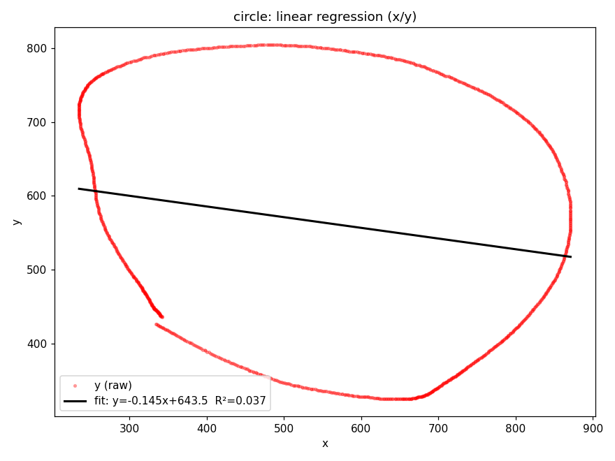
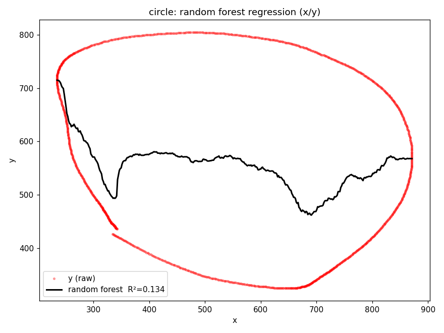

# ML Regression Results — x/y Position

Best-fit overlays from the `lr` (linear regression) and `rf` (random forest)
modes in `grapher.py`, using scikit-learn. Raw points in red, model prediction
in black.

## circle

**Linear regression**

**Random forest**

## uturn2

**Linear regression**

**Random forest**

## flicktopositions

**Linear regression**

**Random forest**

